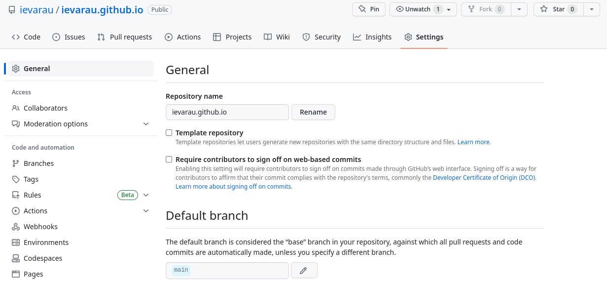
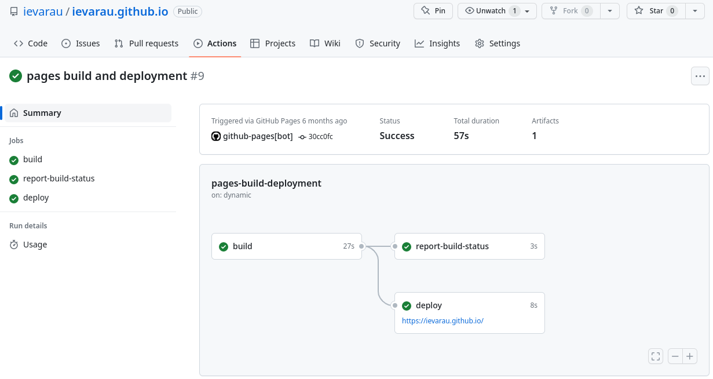
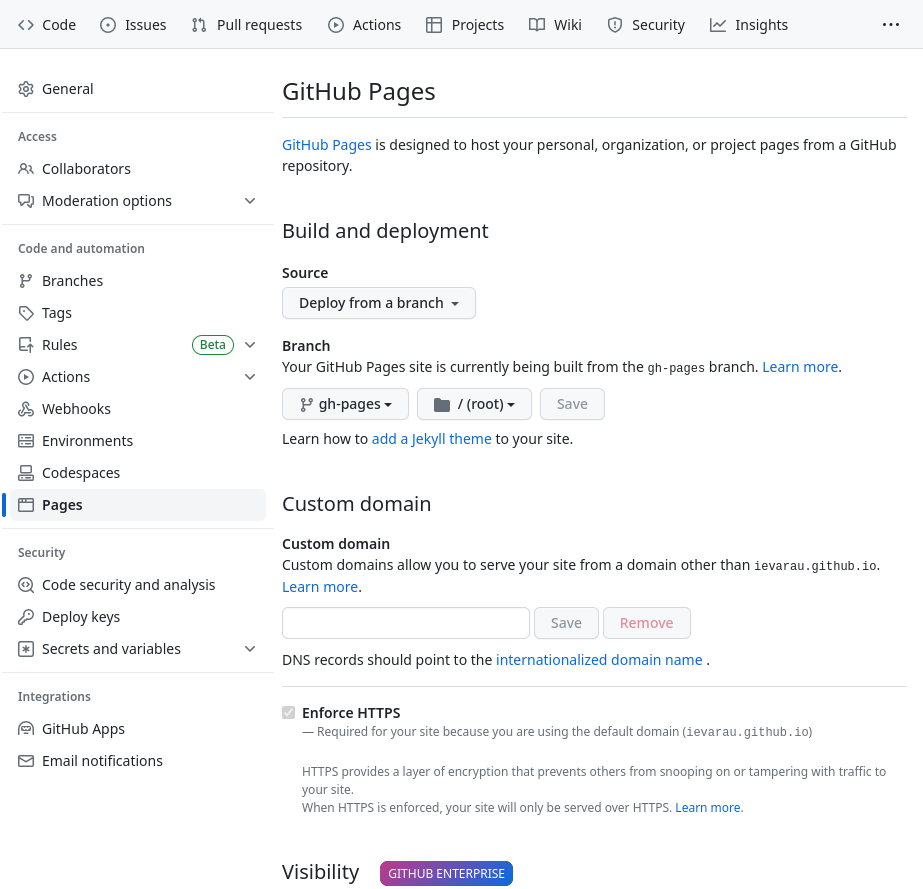

# On Pages and Reports #

In this page you will find some useful information about how you can present your scientfic results to the community through creating webpages using GitHub Pages or Bitbucket.

Three strategies to create and deploy pages will be shown and discussed here:
1. Writing a page as `.html` and deploying on GitHub.
2. Writing a page as `.md` and deploying on GitHub through GitHub Pages.
3. Writing a page as `.html` and deploying on Bitbucket.

All 3 strategies will result in a page hosted by GitHub or Bitbucket. They have their own advantages, but also some disadvantages. Generally, I prefer to write the page as a Markdown (`.md`) document and deploy it using GitHub Pages, which is one of the GitHub actions. This way is probably the most convenient of all three, because GitHub will take care of deployment and some GitHub Pages specific items are really nice (for example, layout and theme of the page can be defined in the config - you can use one of the publicly available themes from Jekyll). Finally, I find it easier to write in Markdown, but if needed you can also use html syntax within `.md` document.

## 1. Writing a page as `.html` and deploying on GitHub ##

You can deploy any `.html` files through repository, but it has to be called `index.htm` and be in you main repository's directory. It can link to other `.html` files, but only in the same directory (can be in the directories downstream) for them to be displayed correctly.

I want to illustrate this with an example of how you can make your personal page, using HTML template and then deploy on your GitHub.

### a. Create a repository with name, ending in `.github.io` ###

The branch can remain as `master`. GitHub will recognize that *Pages* action needs to be applied.

<figure>
  
  <figcaption><b>Fig.1</b> - Settings of your personal page repository.</figcaption>
</figure>

### b. Download the template ###

These days there is plenty of HTML templates available for free, especially for you personal pages. They are, of course, sometimes very specific and more suitable to graphic designers or similar, but you can easily find the one suitable for you. Essentially what you want is to list the projects you work or worked on and write down your experience and education.

[This is the page](https://styleshout.com/free-templates/) I took a template for my page. Just be respectful and do not remove the credit of source.

All you need to do is to download the template and copy it with all its associated to your repository directory. The main page needs to have `index.html` file name.

### c. Edit the template ###

Now adjust the template with information and images you need.

HTML from a template is not that complicated and even if you see a need to edit something more than filling the gaps in the template, there are some nice resources to check. For example:

* **HTML Tags** - [https://www.w3schools.com/tags/tag_comment.asp](https://www.w3schools.com/tags/tag_comment.asp) - list of tags and how to use them. E.g. bold text, paragraph etc.
* **Good practises** of HTML coding - [https://www.w3schools.com/html/html5_syntax.asp](https://www.w3schools.com/html/html5_syntax.asp)

### d. Push the files to remote ###

To build and deploy the page you just need to push updated files to the remote. Every time you push, the page is rebuilt through `Actions`. It can take some time, depending on the size and complexity of your page. You can check the status of building and deployment under `Actions` menu.

<figure>
  
  <figcaption><b>Fig.2</b> - GitHub Actions building page workflow.</figcaption>
</figure>

## 2. Writing a page as `.md` and deploying on GitHub through GitHub Pages ##

This strategy is very similar to the first one, but here you write in *Markdown* and the rest is taken care by GitHub actions.

### a. Create a repository ###

To deploy your page through GitHub Pages, you will need to create a specific repository with `gh-pages` branch (instead of `master`). This is when you want to deploy through a `.md` file. The name of repo can be anything.

<figure>
  
  <figcaption><b>Fig.3</b> - Change repository's branch to GitHub Pages.</figcaption>
</figure>

### b. Write your page in *Markdown* ###

Write you page as a `index.md` files. This will be the main page. It again can link to other `.html` formatted files, but they also must be placed in the subfolders of this same repository to be displayed correctly.

#### Syntax ####

Your `index.md` must include the proper output parameters for GitHub Pages to process it. Include this in your Markdown file parameters section at the beginning of the document:

```
output:
  md_document:
    variant: gfm
```

#### Themes ####

GitHub Pages is nicely compatible with Jekyll. To give your page *a look* all you need to do is to define Jekyll theme in the `_config.yml`. This configuration file needs to be placed in the main repository's directory. Browse all GitHub Pages supported Jekyll themes [here](https://pages.github.com/themes/). Your page will be rendered with this theme only when deployed, but if you want to see it formatted on your computed before pushing to remote, create a `Gemfile`. For more details, see example of one of the supported themes [here](https://github.com/pages-themes/cayman).

#### Tips ####

Even when writing an `.md` files I like to use HTML syntax to insert the figures. GitHub is more friendly towards these kind of things, compared to Bitbucket. Furthermore, for more interactive features it might also be best to use HTML. This, for example, could be drop-down menus.

### d. Push the files to remote ###

Here, same as in strategy 1, you just commit and push your files to remote and your page will be deployed. In *Actions* menu you will see the URL to the page, but it is usually the name of the workplace with extension `github.io` and ending with the name of a repository. For example, `https://ievarau.github.io/on_pages_and_reports/`. But GitHub Pages allow to request for a domain name in the `Pages` settings.

## 3. Writing a page as `.html` and deploying on Bitbucket ##

I think this is my least recommended option. Bitbucket does not have alternatives to GitHub Pages. There is [Hugo webpage](https://gohugo.com.cn/hosting-and-deployment/hosting-on-bitbucket/) that you could host on Bitbucket, but you then have to create [Aerobatics](https://github.com/aerobatic/aerobatic-cli) webpage, which will have a specific URL extension etc. Too much of a hassle :wink:. Furthermore, you basically can host webpages only in one repository, so if your page is heavy, there might be no space for another.

### a. Create a repository ###

You can host a page only through one specifically-named repository. It must include your workspace name, for example, `cbgr.bitbucket.io`. All pages placed in that repository will be accessible through URL starting `https://cbgr.bitbucket.io`. You can place you page in the subfolder and then URL to a page would be `https://cbgr.bitbucket.io/my_page/`. GitHub would allow to create multiple repositories with Pages action and I prefer that, since it is way cleaner to have one repository for one webpage.

### b. Write your page ###

Here you will have to deposit your page as a HTML file, specifically named `index.html`. You can write that page in HTML from the template (see strategy 1), but you can also write in RMarkdown and then just knit the document into HTML format. Later I will use as an example here.

To knit your `.Rmd.` file into HTML, add this to your parameters:

```
output:
  html_document:
    css: style.css
    keep_md: yes
    toc: true
    toc_depth: 2
    toc_float: true
    theme: cerulean
```

Note that theme (`theme: cerulean`) is now defined here in the document itself and not a config.
In this particular case I defined some style elements (reactive table of contents) in `style.css`, so you would need to define the path to that file for those action be defined in the resulting HTML file.

You can read more about css in HTML [here](https://www.w3schools.com/html/html_css.asp) and also usually there are plenty of examples on the web how to implement one or another style elements with css.

### c. Push the files to remote ###

The deployment here is the same, you just commit and push the changes into the remote.

# Contact #

If you have any questions or suggestions, contact me ([Ieva Rauluseviciute](https://ievarau.github.io/)) through ieva.rauluseviciute@gmail.com
